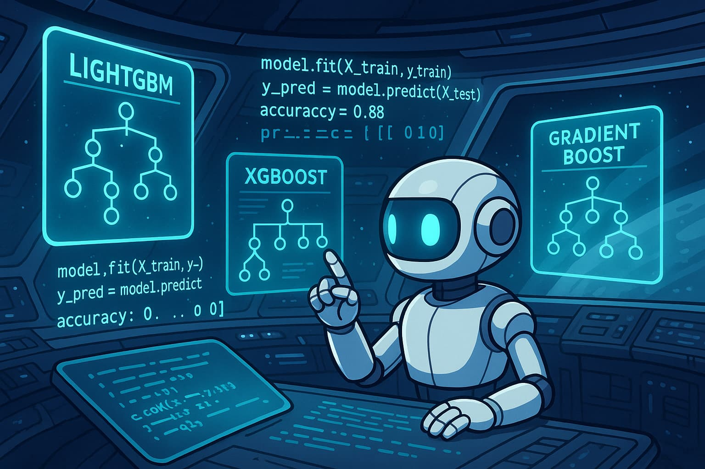
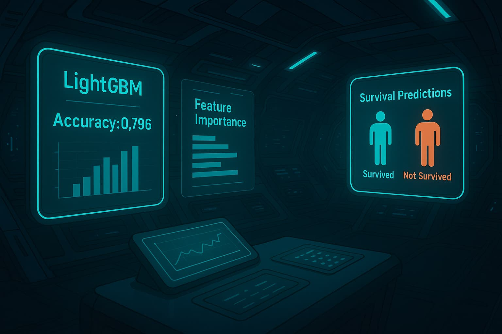

<!DOCTYPE html>
<html lang="en">
<head>
  <meta charset="UTF-8">
</head>
<body style="font-family:Arial, sans-serif; line-height:1.6; max-width:800px; margin:auto; padding:20px;">

  <h1 align="center">🚀 Spaceship Titanic - Passenger Transport Prediction</h1>

  

    
  

  <h2>📘 Overview</h2>
  

    This project predicts whether a passenger aboard the Spaceship Titanic was <strong>Transported</strong> using structured data features like spending behavior, age, and onboard service usage.
    A <strong>LightGBM</strong> model was trained for its efficiency and strong performance on tabular datasets.
  

  <h2>🧹 Data Preprocessing</h2>
  

    The dataset had missing values and required transformation. Here's what was done:
  

  <ul>
    <li>Filled categorical columns (<code>HomePlanet</code>, <code>VIP</code>, etc.) using the mode</li>
    <li>Filled numerical columns (<code>Age</code>, <code>RoomService</code>, etc.) using the median</li>
    <li>Created a new feature <code>TotalSpend</code> by summing service costs</li>
    <li>Dropped original service columns after combining</li>
    <li>Encoded categorical columns using Label Encoding</li>
  </ul>

  

    
  

  <h2>⚙️ Model Training (LightGBM)</h2>
  

    The LightGBM model was selected due to its gradient boosting efficiency. After preprocessing, the data was split into training and validation sets.
    Accuracy was evaluated to ensure the model generalized well to unseen data.
  

  

    
  

  <h2>📈 AI Making Predictions</h2>
  

    After training, the model was used to predict the transport status of passengers in the test dataset. Predictions were made in the form of True/False for each <code>PassengerId</code>.
  

  

    
  

  <h2>📊 Results Dashboard</h2>
  

    Model performance was analyzed using feature importance and validation scores. The top features influencing prediction included <code>TotalSpend</code>, <code>HomePlanet</code>, and <code>CryoSleep</code>.
  

  

    
  

  <h2>🔧 Tools Used</h2>
  <ul>
    <li>Python</li>
    <li>Pandas, NumPy</li>
    <li>Scikit-learn</li>
    <li>LightGBM</li>
    <li>Kaggle</li>
  </ul>

  

  
<em>Created with ❤️ by Sanskar</em>

</body>
</html>
